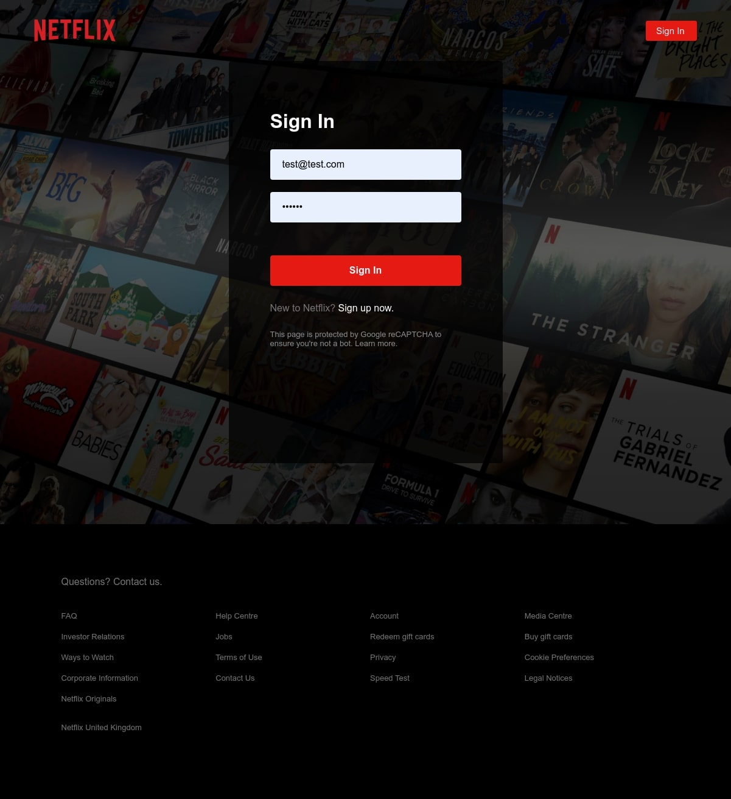
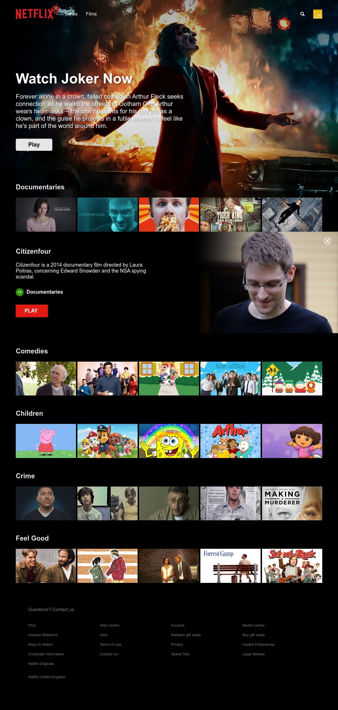
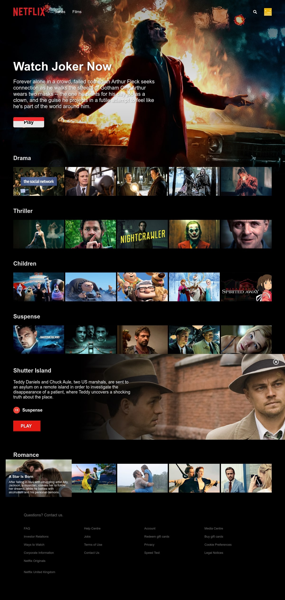

<h1 align="center">
React Netflix TypeScript
<p>
    
</p>
</h1>

This is a clone of the popular Netflix website with reduced functionality.When you log in to a web site, create a new user or use an existing user `test@test.com 112233` enter the closed page of the movie list. Information about authorized users is stored in `localStorage`. Use the `styled-component` to model the component and subdivide it into small pieces. The data is stored on a remote `firebase server`.

## Installation and Running

```sh
git clone git@github.com:Bukovski/react-netflix-ts.git
cd react-netflix-ts
npm install
npm run start
```

## Routes

- `/` home page
- `/signin` signIn page
- `/signup` signUp page
- `/browse` protection page with movie list

## Technologies

- [styled-components](https://styled-components.com/) improved styling of react components
- [normalize.css](https://necolas.github.io/normalize.css/) CSS resets, makes browsers render all elements more consistently and in line with modern standards.
- [react-router-dom](https://github.com/remix-run/react-router) fully-featured routing library for the React
- [firebase](https://firebase.google.com/docs/web/setup) contains the database for the application
- [fuse.js](https://fusejs.io/) dynamic search for app
- [gh-pages](https://github.com/tschaub/gh-pages) publish files on GitHub live page




